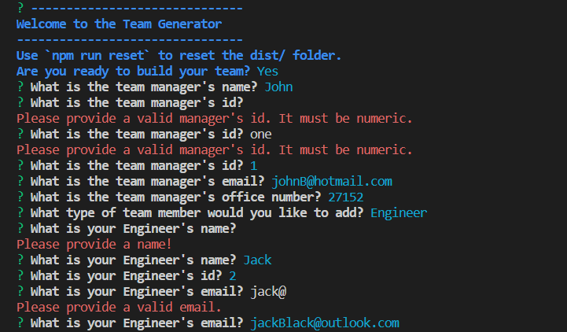

  # [](https://opensource.org/licenses/MIT)

  # Team Profile Generator

  ## Table of Contents
 - [Description](#description)
 - [User Story](#user-story)
 - [Acceptance Criteria](#acceptance-criteria)
 - [Installation](#installation)
 - [Usage](#usage)
 - [License](#license)
 - [Test Instructions](#test-instructions)
 - [Credits](#credits)
 - [Questions](#questions)
  
  ## Description
  This is a command line application which creates a professional Team Profile webpage for an engineering team. The user is prompted for information about their team through a series of questions. This is done using Inquirer. The information supplied is gathered and used to create the index.html file. The finished index.html file displays a summary of each employee in a nicely styled webpage. The page is responsive and the styling is controlled from a css file.

  This is a node.js application and the files are well structured in an easy to follow directory structure. It includes Class files for each type of Employee. The classes utilise inheritance and each Class file has an accompanying unit test file. Testing has been done using Jest and each Class file passed the tests.
 
  The application is developed using the following technologies:
  - javascript
  - node.js
  - inquirer
  - chalk
  - CSS
  - Jest

  The main challenge in developing this application was familiarisation with Jest and writing unit tests to run using Jest.
  
  ## User Story
  AS A manager

  I WANT to generate a webpage that displays my team's basic info

  SO THAT I have quick access to their emails and GitHub profiles


   ## Acceptance Criteria
  GIVEN a command-line application that accepts user input

  WHEN I am prompted for my team members and their information

  THEN an HTML file is generated that displays a nicely formatted team roster based on user input

  WHEN I click on an email address in the HTML

  THEN my default email program opens and populates the TO field of the email with the address

  WHEN I click on the GitHub username

  THEN that GitHub profile opens in a new tab

  WHEN I start the application

  THEN I am prompted to enter the team manager’s name, employee ID, email address, and office number

  WHEN I enter the team manager’s name, employee ID, email address, and office number

  THEN I am presented with a menu with the option to add an engineer or an intern or to finish building my team

  WHEN I select the engineer option

  THEN I am prompted to enter the engineer’s name, ID, email, and GitHub username, and I am taken back to the menu

  WHEN I select the intern option

  THEN I am prompted to enter the intern’s name, ID, email, and school, and I am taken back to the menu

  WHEN I decide to finish building my team

  THEN I exit the application, and the HTML is generated


  ## Installation
  Ensure node is installed. Test by running 
  ```
  node -v
  ```

  To install this package run:
  ```
  npm install
  ```

  Ensure you have installed Inquirer and chalk: 
  ```
  npm i inquirer@8.2.4
  nmp i chalk
  ```

  To install jest for unit testing:
  ```
  npm install --save-dev jest
  ```

  ## Usage
  To run this application enter:
```
node index.js
```
The user is initially provided with some information on how the application works and asked if they want to continue. If they choose "Yes" to continue, they will be brought through all the other questions. If they choose "No" to continue the application will exit.


Most questions have validation and if the users input fails validation, the user will be informed via a message written in red. Validation includes checking ID and Office Number are numeric, Email and Github are valid and no fields are left blank. The relevent questions will be presented depending on which type of employee is being input eg github for engineers and school for interns. 



The user can enter as many employees as they like. They will continue to be prompted to add the next employee and when they have finished they simply select "None - I am finished!".


Once all the questions have been answered the index.html file will be generated. It will be saved into the same directory the application is run from.
  
  

  Below is the Team Profile webpage:

  
  
  Below is a link to a video recording of how the application works.

  [Video](https://drive.google.com/file/d/1Gr6uHlHL-qQM7KmtPuBT5R97mNQEZvds/view)

  ## License
  This project is covered by the "The MIT License" license.
  For more details click on the link below:
  [License](https://opensource.org/licenses/MIT)
  
  
  ## Test Instructions
  Ensure Jest has been installed. From the team-profile-generator directory run the following command:
  ```
  npm test
  ```
  When jest is set to run in "watch" mode you will be presented with the below screen:

  
  
  Press "a" to run all tests. Below is the results of the tests:

  

  ## Credits
  I would like to thank the instructors at UWA Bootcamp. 
  
  ## Questions
 If you have any questions or feedback please contact me. My details are below. As this is a learning challenge for me I would appreciate any feedback, or ideas for improvement.

 Github : https://github.com/HelenELee 

 Email : helenelee3@outlook.com
  